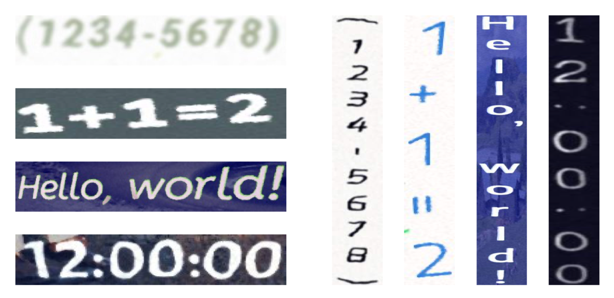
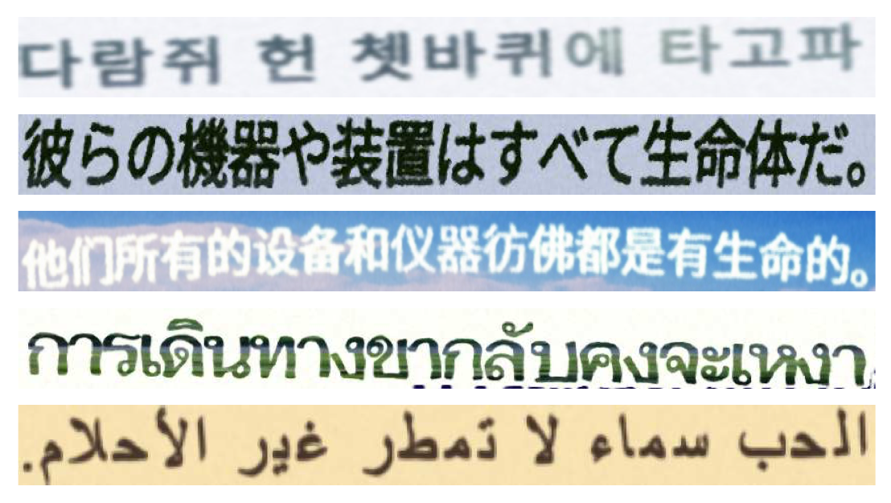

# 🐯 SynthTIGER: Synthetic Text Image GEneratoR

Official implementation of SynthTIGER | [Paper](https://arxiv.org/abs/2107.09313) | [Datasets](#datasets)

**[Moonbin Yim](https://github.com/moonbings)<sup>1</sup>, Yoonsik Kim<sup>1</sup>, Han-cheol Cho<sup>1</sup>, Sungrae Park<sup>2</sup>**

<sup>1</sup> Clova AI Research, NAVER Corp.

<sup>2</sup> Upstage AI Research

<br/>
<br/>


<br/>
<br/>

## Contents

- [Updates](#updates)
- [Datasets](#datasets)
- [Usage](#usage)
- [Advanced Usage](#advanced-usage)
- [Citation](#citation)
- [License](#license)

## Updates

## Datasets

SynthTIGER is available for download at [google drive](https://drive.google.com/drive/folders/1faHxo6gVeUmmFKJf8dxFZf_yRjamUL96?usp=sharing).

**synthtiger_v1.0.zip** (36G) (md5: 5b5365f4fe15de24e403a9256079be70)

- Original paper version.

**synthtiger_v1.1.zip** (38G) (md5: b2757a7e2b5040b14ed64c473533b592)

- Used MJ/ST lexicon instead of MJ/ST label.
- Fixed a bug that applies transformation twice on curved text.
- Fixed a bug that incorrectly converts grayscale to RGB.

| Version | IIIT5k | SVT | IC03 | IC13 | IC15 | SVTP | CUTE80 | Total |
| ------- | ------ | --- | ---- | ---- | ---- | ---- | ------ | ----- |
| 1.0 | 93.2 | 87.3 | 90.5 | 92.9 | 72.1 | 77.7 | 80.6 | 85.9 |
| 1.1 | 93.4 | 87.6 | 91.4 | 93.2 | 73.9 | 77.8 | 80.6 | 86.6 |

### Structure

The structure of the dataset is as follows. The dataset contains 10M images.

```
gt.txt
images/
    0/
        0.jpg
        1.jpg
        ...
        9998.jpg
        9999.jpg
    1/
    ...
    998/
    999/
```

The format of `gt.txt` is as follows. Image path and label are separated by tab. (`<image_path>\t<label>`)

```
images/0/0.jpg	10
images/0/1.jpg	date:
...
images/999/9999998.jpg	STUFFIER
images/999/9999999.jpg	Re:
```

## Usage

```bash
# for macOS
$ export OBJC_DISABLE_INITIALIZE_FORK_SAFETY=YES

# install python packages
$ pip install -r requirements.txt

$ python gen.py --template TEMPLATE
                --config CONFIG
                --output OUTPUT
                [--count COUNT]
                [--worker WORKER]
```

### Requirements

- python >= 3.6
- libraqm

### Parameters

| Name | Type | Default | Description |
| ---- | ---- | ------- | ----------- |
| template | ```string``` | | Template module path |
| config | ```string``` | | Config file path |
| output | ```string``` | | Folder path to save data |
| count | ```integer``` | ```100``` | Number of data |
| worker | ```integer``` | ```1``` | Number of workers |

### Examples

#### Default text images

```bash
# horizontal
python gen.py --template templates/default.py --config templates/default_horizontal.yaml --output results --worker 4

# vertical
python gen.py --template templates/default.py --config templates/default_vertical.yaml --output results --worker 4
```



#### Multiline text images

```bash
python gen.py --template templates/multiline.py --config templates/multiline.yaml --output results --worker 4
```


## Advanced Usage

### Non-Latin language data generation



1. Prepare corpus and fonts

   corpus - txt file, line by line ([example](resources/corpus/mjsynth.txt))

   font - ttf/otf file ([example](resources/font))

2. Extract renderable charsets

   ```bash
   python tools/extract_font_charset.py --input fonts --worker 4
   ```

   This script extracts renderable charsets for all font files. ([example](resources/font/Ubuntu-Regular.txt))

   Text files are generated in the input path with the same names as the fonts.

3. Edit corpus path and font path in config file

4. Run gen.py

### Colormap customization

1. Prepare images

   image - jpg/jpeg/png/bmp file

2. Create colormaps

   ```bash
   python tools/create_colormap.py --input images --output colormap.txt --worker 4
   ```

   This script creates colormaps for all image files. ([example](resources/colormap/iiit5k_gray.txt))

3. Edit colormap path in config file

4. Run gen.py

## Citation

```
@article{yim2021synthtiger,
  title={SynthTIGER: Synthetic Text Image GEneratoR Towards Better Text Recognition Models},
  author={Yim, Moonbin and Kim, Yoonsik and Cho, Han-Cheol and Park, Sungrae},
  journal={arXiv preprint arXiv:2107.09313},
  year={2021}
}
```

## License

```
SynthTIGER
Copyright (c) 2021-present NAVER Corp.

Permission is hereby granted, free of charge, to any person obtaining a copy
of this software and associated documentation files (the "Software"), to deal
in the Software without restriction, including without limitation the rights
to use, copy, modify, merge, publish, distribute, sublicense, and/or sell
copies of the Software, and to permit persons to whom the Software is
furnished to do so, subject to the following conditions:

The above copyright notice and this permission notice shall be included in
all copies or substantial portions of the Software.

THE SOFTWARE IS PROVIDED "AS IS", WITHOUT WARRANTY OF ANY KIND, EXPRESS OR
IMPLIED, INCLUDING BUT NOT LIMITED TO THE WARRANTIES OF MERCHANTABILITY,
FITNESS FOR A PARTICULAR PURPOSE AND NONINFRINGEMENT.  IN NO EVENT SHALL THE
AUTHORS OR COPYRIGHT HOLDERS BE LIABLE FOR ANY CLAIM, DAMAGES OR OTHER
LIABILITY, WHETHER IN AN ACTION OF CONTRACT, TORT OR OTHERWISE, ARISING FROM,
OUT OF OR IN CONNECTION WITH THE SOFTWARE OR THE USE OR OTHER DEALINGS IN
THE SOFTWARE.
```

The following directories and their subdirectories are licensed the same as their origins. Please refer to [NOTICE](NOTICE)
```
docs/
docsrc/
resources/font/
```
